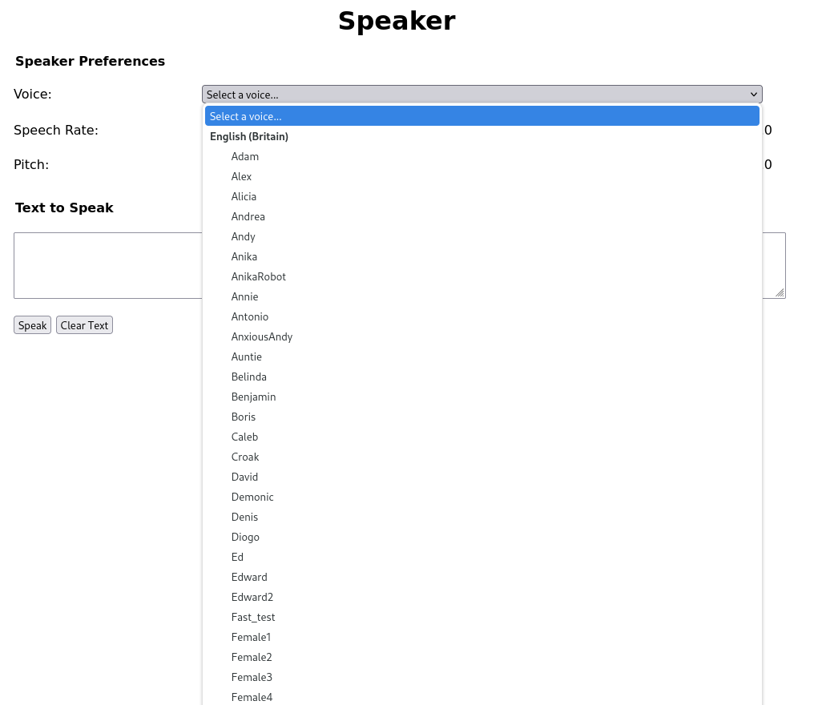

# Speaker

## Overview

Speaker is a dirt simple experiment with browser-based speech synthesis.

At its worst, it harkens back to the halcyon days of the TI-99/4A and Amiga.

At its best, it fits right in with sci-fi computer speech.

This experiment was ignited by some AI chat tool that did remarkably good speech synthesis.

I was surprised, and since the tool was a local install, I was intrigued.

Down the rabbit hole I went, and hit upon the `speechSynthesis` browser API...

## Details

This example produces results of varying quality.

The synthesized speech API can call on remote voices (Google, Microsoft) which yields very impressive results.

Firefox, even if it is making remote calls, relies on more traditional speech synthesis, and provides more robotic results.

The amount of speech you can synthesize appears to be throttled by Google Chrome, but after a cooling off period, you can synthesize more.

Firefox and Edge don't have any apparently immediate throttles on the amount of speech processed.

Firefox provides over 13000 voices, with approximately 120 for English (including variant sets for en-US, en-GB, en-US-NYC and en-GB-SCOTLAND).

Unfortunately, the Firefox voices are often hard to distinguish, and the default rate of 1.0 is a little fast.

Google Chrome offers up a handful of voices, with only 3 active English variants.

Microsoft Edge offers up more variety with over 20 English variants.

Both Chrome and Edge read well at the default rate of 1.0.

## Screenshots

## License

This code is licensed under the [MIT License](LICENSE.md).

